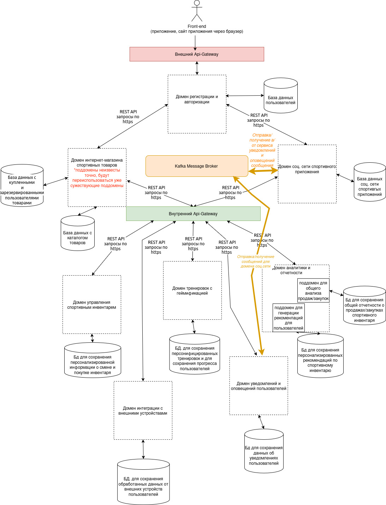

## Оглавление
11. [Список ADR][def]
12. [Описание сценариев использования приложения][def2] 
13. [Базовая архитектура с учётом ограничений бизнес-требований, НФТ, выбранной архитектуры, адресация атрибутов качества][def3]
14. [Основные представления][def4]

## Список ADR
[def]: #Список-ADR
 Разделю ADR на три типа: ADR для UI/GUI-дизайнеров, ADR для фронта, ADR для бэка.
### ADR UI/GUI Дизайн
#### UI/GUI-ADR-001:
**Дата:** 2024-10-01  
**Статус:** Принято  
**Контекст:**
Приложение должно сочетать в себе функциональность интернет-магазина спортивных товаров и социальных сетей с акцентом на спортивную сферу. Поэтому важно выбрать подход к проектированию UI/GUI, который обеспечит простоту использования, узнаваемость элементов (легкое ориентирование пользователя), плюс удобство для фронт-энд разработчиков.

**Решение:**  
Использование Material Design. Это дизайн от Google, который предлагает готовую систему компонентов, что значительно ускоряет процесс разработки. Он также обеспечивает единообразный и интуитивный интерфейс благодаря ясным визуальным подсказкам и анимациям. Это будет полезно для создания как интернет-магазина, так и социальной платформы.

**Последствия:** 
Пользователи будут легко ориентироваться в приложении благодаря привычному стилю интерфейса, что может повысить удовлетворенность и удержание пользователей.
Фреймворки Vue.js, React.js, Angular поддерживают компонентный подход (Vuetify, Material UI, Angular Material).

---

### ADR для фронта
#### FRONT-ADR-001:
**Дата:** 2024-10-01  
**Статус:** Принято  
**Контекст:**
Необходимо быстро и недорого разработать приложение. При этом фронт-энд часть должна быть в виде микросервисов (в разработку будут привлечены люди из разных стран), монолитный фронт-энд исключается. Плюс фреймворк должен поддерживать Material Design. У используемого фреймворка должно быть большое сообщество и перспектива развития.

**Решение:**  
Использование React с Material UI будет более предподчтительным.

**Последствия:** 
React более легковесная библиотека, которая позволяет более свободно организовывать структуру приложения. Можно отдельно разрабатывать различные компоненты или модули и затем интегрировать их в приложение — это хорошо подходит для микросервисной архитектуры.

React имеет обширную экосистему со множеством сторонних библиотек и инструментов, что позволяет использовать только те инструменты, которые необходимы для выполнения конкретной задачи, что увеличивает гибкость и возможность адаптации.

React позволяет разработчикам сосредоточиться на создании отдельных компонентов, которые могут быть разработаны и протестированы независимо друг от друга, что способствует лучшему распределению задач внутри команды.

React проще интегрировать с другими библиотеками и фреймворками, что может быть полезно при построении микросервисной архитектуры, где разные службы могут требовать разных технологий.

На данный момент React по-прежнему занимает более значимую позицию на рынке труда по сравнению с Angular (проще найти людей). Это связано с его широкой популярностью и адаптивностью, а также с активной поддержкой со стороны сообщества и крупных компаний (например, Facebook).
 
----

### ADR для бэка
Здесь сосредоточусь на особенностях, связанных с принятыми архитектурными решениями (ADR), привязанными к конкретным доменам или модулям.
#### Back-ADR-001: Модуль регистрации и аутентификации

**Дата:** 2024-10-01  
**Статус:** Принято  
**Контекст:**  
Пользователи должны иметь возможность регистрироваться в системе, предоставляя свои персональные данные, и входить в систему с использованием проверенных методов аутентификации. Необходимо обеспечить регистрацию новых пользователей и аутентификацию с использованием социальных сетей и многофакторной аутентификации для повышения безопасности. 

**Решение:**  
Реализовать модуль, использующий OAuth для аутентификации через социальные сети и внедрить многофакторную аутентификацию через SMS/Email.
Использовать токены JWT (JSON Web Tokens) для аутентификации пользователей, и реализовать функционал регистрации, который включает проверку email и подтверждение учетной записи.

**Последствия:**  
Увеличение безопасности пользователей за счет многофакторной аутентификации. Использование проверенных методов аутентификации повысит доверие к системе. Наличие интеграции с социальными сетями упростит процесс регистрации, что может привести к увеличению числа пользователей.
Но увеличивается сложность разработки и тестирования, 
появляется необходимость уделить внимание безопасному хранению и передаче данных пользователей. Требуется внедрить механизмы защиты для хранения и передачи паролей, такие как шифрование и использование HTTPS. Необходимо провести аудит безопасности для предотвращения утечек личной информации.

---

#### Back-ADR-002: Модуль социальной сети с уклоном в спортивную сферу

**Дата:** 2024-10-04  
**Статус:** Принято  
**Контекст:**  
Модуль должен обеспечивать создание и управление социальными группами, общение между участниками и систему модерации.
Пользователи должны иметь возможность создавать и редактировать свои посты, комментарии и отзывы о товарах. А также иметь возможность взаимодействовать через комментарии, лайки и ответы.

Также необходимо обеспечить защиту от онлайн-насилия и соблюдение норм законодательства относительно обработки пользовательского контента, поэтому следует иметь эффективную систему модерации для обработки жалоб на неподобающий контент.

**Решение:**  
Реализовать функционал групп и чатов, а также модерации контента с использованием REST API и веб-сокетов для реального времени. При этом система должна быть интегрирована с модулем уведомлений для оповещений.

Создать инструмент для модераторов, где они смогут отслеживать и управлять жалобами на контент, используя административную панель.

**Последствия:**
Создание активного сообщества пользователей повысит вовлеченность и взаимодействие среди участников. Эффективная система модерации обеспечит безопасность пользователей и способствует поддержанию здоровой атмосферы обсуждения.  

---

#### Back-ADR-003: Модуль управления спортивным инвентарем

**Дата:** 2024-10-04  
**Статус:** Принято  
**Контекст:**  
Пользователи могут вводить данные о своей спортивной экипировке на своей странице соц. сети и получать рекомендации по обновлению инвентаря с ссылкой на товар в каталоге. Если пользователь приобрел новый инвентарь, то необходимо сохранить запись об этом в базе данных. А затем через какое-то время оповещать пользователя о том, что инвентарь необходимо сменить.

**Решение:**  
Разработать модуль с внедренной моделью машинного обучения, который будет брать введенную пользователями информации о спортивном инвентаре, а также данные о пользователе и его спортивной активности, и о ранее купленном спортивном инвентаре в приложении. На основе этих данных система будет генерировать персонализированные рекомендации по смене или покупке оборудования, включая ссылки на конкретные товары.

**Последствия:**  
Улучшение качества рекомендаций на основе индивидуальных данных пользователей.
Увеличение интереса пользователей к платформе через актуальные предложения по обновлению инвентаря.
Обеспечение механизмов проверки и валидации введенной информации.
Направление пользователей на конкретные товары может привести к росту продаж и улучшению клиентского опыта.

---

#### Back-ADR-004: Модуль тренировок с геймификацией

**Дата:** 2024-10-04  
**Статус:** В разработке
**Контекст:**  
Модуль должен анализировать данные о тренировках и генерировать персонализированные планы. Поощрять пользователя в случае следования планам тренировок. Данные о результатах тренировок должны сохраняться. Для того чтобы, например, пользователь мог сравнивать свои результаты тренировок, или результаты тренировок других пользователей в этом же виде спорта.

**Решение:**  
Необходимо разработать и обучить модель машинного обучения, которая будет генерировать персонализированные планы тренировок для пользователей на основе их данных о тренировках, спортивном инвентаре и информации из социальной сети приложения. В процессе создания данной модели важно привлечь тренеров различных видов спорта в качестве экспертов, чтобы обеспечить ее корректность и эффективность.

Кроме того, на основе данных из модуля интеграции с внешними устройствами следует разработать систему поощрений. При этом необходимо учесть, что некоторые пользователи могут не обладать фитнес-трекерами (сторонними устройствами), и создать систему вознаграждений, которая будет мотивировать всех пользователей, независимо от наличия дополнительных устройств.

Возможно придется хранить большие объемы данных. Предлагается использовать:
Реляционные базы данных (например, PostgreSQL, MySQL) для упорядоченных данных с четкими связями.

**Последствия:**  
Использование машинного обучения для генерации индивидуальных планов тренировок позволит учитывать особенности каждого пользователя, включая его уровень подготовки, предпочтения и цели. Это повышает эффективность тренировок и снижает риск травм. Механизмы поощрения и игровые элементы помогут удержать пользователей в приложении дольше, снижая вероятность отказа от использования. Пользователь будет возвращаться, чтобы продолжать получать новые достижения и улучшать свои результаты.

Зависимости от модуля интеграции с внешними устройствами, а также от модуля соц. сети. Необходимо уделять внимание согласованию форматов данных.

---

#### Back-ADR-005: Модуль уведомлений и оповещений пользователей

**Дата:** 2024-10-04  
**Статус:** Принято  
**Контекст:**  
Пользователи должны получать уведомления о достижениях и событиях, например, от модуля тренировок с геймификацией. Пользователи должны быть оповещены действиях других пользователей (интеграция с модулем соц. сети). Данный модуль будет интегрироваться со всеми системами, которые способны триггерить оповещения для пользователей соц. сети или приложения в целом.

**Решение:**  
Разработать систему уведомлений, интегрированную с другими модулями для формирования релевантной информации и ее своевременной отправки.
Модуль уведомлений будет разделен на независимые микросервисы, каждый из которых будет отвечать за различные аспекты системы уведомлений, такие как:
- Генерация уведомлений
- Отправка уведомлений

Для данного модуля будет использоваться событийно-ориентированный подход. События, такие как достижения в тренировках или активность друзей в социальных сетях, оповещения о рекомендациях сменить спортивный инвентарь и пр. будут служить триггерами для инициирования создания и отправки уведомлений. Это может быть реализовано с помощью системы управления сообщениями, например, Apache Kafka, RabbitMQ или AWS SNS.

Необходимо будет разработать систему шаблонов для различных типов уведомлений, что позволит легко настраивать содержание уведомлений в зависимости от контекста (тренировки, социальные взаимодействия и т.д.).
Потребуется создать отдельный модуль для отправки уведомлений через различные каналы (мобильные уведомления, электронная почта, sms и т.д.), настраивая методы в зависимости от предпочтений пользователей.

**Последствия:**  
В данном случае использование событийно-ориентированной архитектуры и микросервисов обеспечит устойчивую и эффективную систему оповещения, которая может легко адаптироваться к изменяющимся требованиям бизнеса и пользователей.
Из минусов: необходимость поддержания актуальности данных и сложность настройки систем уведомлений с учетом предпочтений пользователей.

---

#### Back-ADR-006: Модуль интеграции с внешними устройствами

**Дата:** 2024-10-04  
**Статус:** Принято  
**Контекст:**  
Модуль должен подключаться с фитнес-трекерами и другими устройствами для сбора данных о тренировках.

**Решение:**  
Изучить рынок фитнес-трекеров и сторонних wearable health monitoring devices в регионах, где будет продаваться/распространяться приложение. Выделить топ фитнес-трекеров по продажам/скачиванию на телефон топ сторонних wearable health monitoring devices. Изучить используемые ими протоколы (возможность коннекта с ними для получения данных). Использовать эти протоколы (например, Bluetooth, NFC (для установки контакта)) для интеграции с устройствами, приложениями (или уметь использовать api какого-либо распространенного приложения/устройства). Реализовать механизм обработки и нормализации данных в разных форматах, поступающих от различных носимых устройств. Создать архитектуру хранения данных, способную эффективно обрабатывать большие объемы информации (Big Data), включая систему, которая будет автоматически удалять устаревшие данные после определенного периода хранения для оптимизации места и повышения производительности. Необходимо реализовать меры по защите данных пользователей, включая шифрование и анонимизацию.

**Последствия:**  
Использование различных протоколов, способов интеграции даст возможность устанавливать стабильные соединения с устройствами различных производителей, таким образом будут собираться данные активности пользователей для их дальнейшей обработки и нормализации.

Эффективное управление большими объемами данных, включая автоматическое удаление устаревшей информации снизит затраты на хранение.

За счет нормализации данных появится возможность более эффективно проводить анализ собранных данных для извлечения полезной информации и выявления тенденций в тренировочном процессе пользователей.

---

#### Back-ADR-007: Модуль с каталогом товаров

**Дата:** 2024-10-04  
**Статус:** Принято  
**Контекст:**  
Необходим классический интернет-магазин для продажи спортивного оборудования. Пользователи должны иметь возможность искать товары с помощью различных фильтров: по категориям, цене, популярности и т.д. Класть товары в корзину, оплачивать их. Оформлять доставку

**Решение:**  
Создать модуль или/и выстроить интеграцию с существующими модулями, которые будen интегрироваться с платежными системами, управлять каталогом товаров, корзиной, доставкой. 
Если не реализовано: реализовать полнотекстовый поиск с возможностью фильтрации через разработку REST API. Использовать Elasticsearch для быстрой обработки запросов.
Интегрировать платежный шлюз (например, Stripe или PayPal) для обработки платежей и использования API для оформления заказа (если старые модули не используют это).

**Последствия:**  
Необходима проработка всех аспектов безопасности при обработке платежей; Необходимо гарантировать соблюдение стандартов безопасности (например, PCI DSS) и учитывать возможные риски ошибок обработки платежей. Необходимо учесть ненадежность сети интернет в случае, если будет осуществлена интеграция (по рест апи, например) с уже существующими модулями интернет-магазина.

---

#### Back-ADR-008: Аналитика и отчетность

**Дата:** 2024-10-04  
**Статус:** В разработке. 
**Контекст:**  
Для пользователей: cистема должна собирать и анализировать пользовательские данные для улучшения контента под каждого конкретного пользователя, и для всех пользователей в целом.
Общее (для бизнеса): cистема должна проводить общий анализ, например, спроса на определенные товары. Анализ посещаемости страниц.
Формировать отчеты.

**Решение:**
Следует разработать и обучить модель машинного обучения, которая эффективно будет подбирать контент, соответствующий спортивным интересам и предпочтениям пользователей (например, показывать товары, которые могут его заинтересовать, показывать группы пользователей с общими интересами).
Интегрировать инструменты аналитики (например, Google Analytics) и реализовать собственные отчеты с использованием BI-инструментов.

**Последствия:**

Модель ML позволит эффективно анализировать предпочтения пользователей и их поведение, что обеспечит выдачу более релевантного и интересного контента, увеличивая тем самым удовлетворенность пользователей. Персонализированные рекомендации могут способствовать большему времени, проведенному пользователями в приложении, а также повышению активности (лайки, комментарии, шеры). Индивидуально подбираемый контент может значительно увеличить вероятность повторного использования приложения, так как пользователи будут более заинтересованы в контенте, который соответствует их интересам. Модель может выявить наиболее привлекательные темы и типы контента, что поможет в дальнейшем планировании и производстве более качественного материала.
Улучшенное понимание пользовательского поведения: Инструменты аналитики позволяют собирать данные о поведении пользователей на сайте или в приложении, что помогает лучше понять их предпочтения и пути взаимодействия с продуктом. Это знание может быть использовано для оптимизации пользовательского опыта.

Интеграция с аналитическими инструментами позволяет получать данные о взаимодействии пользователей в реальном времени, что помогает быстро реагировать на изменения в поведении пользователей или в эффективности маркетинговых кампаний. BI-инструменты предоставляют мощные возможности визуализации данных, позволяя легко анализировать и интерпретировать результаты. Визуальные отчеты делают данные более доступными и понятными для всех заинтересованных сторон.
Отчеты и аналитика дают возможность анализировать данные, делать выводы и принимать обоснованные решения на основе фактических данных, а не предположений.
С помощью аналитики можно определить, какие каналы маркетинга приносят наилучшие результаты, и сосредоточить усилия и бюджет на наиболее эффективных стратегиях.
Инструменты аналитики позволяют устанавливать и отслеживать ключевые показатели эффективности (KPI), что помогает в оценке успеха бизнеса и в выявлении областей для улучшения.
С помощью аналитики можно выявлять тренды и паттерны в данных, что помогает не только в текущем управлении бизнесом, но и в долгосрочном планировании и прогнозировании.
Лучше понимая, какие тактики работают, компании могут сократить ненужные расходы и инвестировать в более продуктивные стратегии.

Возможные риски неправильной интерпретации данных и вопросы конфиденциальности пользователей; требуется соблюдение норм GDPR.

## Описание сценариев использования приложения
[def2]: #Описание-сценариев-использования-приложения
В данном разделе хотелось бы сосредоточить внимание на уникальных сценариях использования (USE CASE), которые выходят за рамки стандартных функций приложений, ориентированных исключительно на продажу спортивных товаров (интернет-магазин), либо за рамки функций стандартных соц. сетей, типа, Facebook, например.

Изучение сценариев, связанных с социальной сетью приложения, представляет собой особый интерес. Одним из ключевых аспектов является возможность подбора групп для пользователей на основе их спортивных интересов, а также создание пользователями собственных групп для совместных тренировок и активного общения.

Кроме того, следует обратить внимание на то, как система может адаптировать предложения по спортивному инвентарю в зависимости от профиля пользователя, его любимых видов спорта, а также на основе данных о ранее совершенных покупках в приложении и сведений, полученных через интеграцию с фитнес-трекерами и со сторонними wearable health monitoring devices.

Не менее важными являются сценарии, позволяющие системе составлять индивидуальные планы занятий, которые учитывают персональные данные о пользователе и его физическое состояние. Также стоит рассмотреть механизмы поощрения пользователей за выполнение данных тренировочных программ, что будет способствовать повышению их мотивации.

Пользователи должны иметь возможность сравнивать результаты своих тренировок как с предыдущими достижениями, так и с результатами других пользователей.

Функционал модуля оповещений не менее значим, так как он информирует пользователей о новых событиях, обновлениях и важной информации (например, о новых спортивных достижениях друзей в соц. сети приложения), способствуя поддержанию их вовлеченности.

Кроме того, полезно рассмотреть работу модераторов контента в социальной сети, особенно в контексте обработки жалоб пользователей. Эффективная модерация гарантирует создание безопасной и поддерживающей атмосферы для всех участников сообщества.

----
### USE CASE 1: Регистрация нового пользователя в соц. сети приложения

При этом на основе данных после регистрации на странице пользователя появляются рекомендации о группах со схожими спортивными интересами, список интвентаря, подходящий для того вида спорта, который указал пользователь, план тренировок.

**Акторы**:
*Новый Пользователь*,
*Система* (модуль регистрации и аутентификации,
модуль, модуль тренировок с геймификацией, модуль интеграции с внешними устройствами, модуль анализа и отчетности, модуль каталога товаров, модуль социальной сети с уклоном в спортивную сферу)

**Описание**:

Новый пользователь регистрируется в приложении, заполняет данные о себе и получает рекомендации по группам со схожими интересами и подборку спортивного инвентаря. Хочу отметить, что сценарии (позитивные, негативные) работы модуля регистрации и аутентификации не будет здесь рассматриваться.

**Основной сценарий**:

- Пользователь инициирует процесс регистрации:

- Пользователь открывает приложение и выбирает опцию регистрации.

 - Пользователь вводит личные данные: 

 *Поля для заполнения*: электронная почта*, логин*, пароль*

 - Система присылает уведомления на указанную почту с авторизационной ссылкой

 - Пользователь переходит по ссылке и дозаполняет данные о себе: телефон*, возраст*, рост*, вес*, пол*, заболевания (если есть), любимый вид спорта* + город проживания, возможно клуб, где человек тренируется

- Пользователь предоставляет согласие на интеграцию с фитнес-трекерами или со сторонними wearable health monitoring devices (если они есть) или отказывается.

- Система обрабатывает введенные данные:

Система сохраняет информацию о пользователе.

- Анализ данных:

Система анализирует введенные данные с помощью модуля анализа данных.

- Рекомендации:

Система выдает пользователю список групп со схожими спортивными интересами.

Система предоставляет подборку спортивного инвентаря, который можно приобрести на сайте.

- Пользователь принимает решения:

Пользователь выбирает группы для присоединения и/или товары для покупки.

**Альтернативные сценарии**:

Если пользователь вводит некорректные данные (например, негативный вес), система уведомляет его об ошибке и просит исправить информацию.

Если пользователь отказывается интегрироваться с фитнес-трекерами, система продолжает анализ без этой информации и дает рекомендации на основе остальных данных.

**Диаграмма**:

----

### USE-CASE 2: Следование планам тренировок с интеграцией с фитнес-трекером на телефоне или со сторонними wearable health monitoring devices с возможным поощрением (геймификация)

**Акторы**: *зарегистрированный пользователь* (человек, который хочет следовать планам тренировок), *система* (модуль регистрации и аутентификации, модуль социальной сети с уклоном в спортивную сферу, модуль тренировок и геймификации, модуль интеграции с внешними устройствами,  модуль уведомлений и оповещений пользователей), *друзья пользователя по соц. сети приложения*

**Описание**:

Пользователь хочет начать следовать предложенным системой планам тренировок с использованием интеграции с фитнес-трекером или/и со сторонними wearable health monitoring devices.

**Основной сценарий**:

- Пользователь заходит в приложение:

- Пользователь открывает свою страницу в социальной сети приложения.

*Начало тренировки*:

- Пользователь выбирает опцию «Начать тренировку».

- Система предлагает начать сеанс тренировки и предоставляет информацию о выбранном плане.

- Интеграция с фитнес-трекером или/и со сторонними wearable health monitoring devices:

- Пользователь включает свой фитнес-трекер или сторонний wearable health monitoring devices для сбора данных о тренировке.

*Тренировка*:

- Пользователь выполняет тренировку в течение определенного времени.

*Остановка тренировки*:

- Пользователь завершает сеанс тренировки через интерфейс приложения. Данные сохраняются. Корректируется план тренировок (например, при неуспешной тренировке добавляется дополнительный сеансы, а при успешном, сеанс отмечается пройденным).

*Обработка данных*:

- Модуль тренировок и геймификации активируется. Система анализирует данные с фитнес-трекера (или со сторонних wearable health monitoring devices) + данные о теле (масса, пол, рост), далее рассчитывает, например, количество сожженных калорий.

*Поощрение*:

- Если алгоритмы машинного обучения заключают, что пользователь сжег достаточное количество калорий, система предоставляет ему поощрение, например, скидку на спортивный инвентарь.

*Уведомление друзей*:

- Если пользователь настроил разрешение на оповещение, система уведомляет его друзей о достигнутом результате.

**Альтернативные сценарии**:

- Пользователь не получает поощрение, если сожженные калории ниже установленного порога. В этом случае модуль тренировок и геймификации корректирует план тренировки (например, добавляет дополнительный сеанс тренировки).

- Пользователь отменяет тренировку до её завершения, и никакие оповещения не отправляются.

**Диаграмма**:

PS: Предполагается, что пользователь уже авторизован в системе
----

### USE CASE 3: Следование тренировочного плана без интеграции с фитнес-трекерами на телефоне или со стронними устройствами с геймификацией

**Акторы**: *зарегистрированный пользователь* (человек, который хочет тренироваться по предложенному системой плану тренировок и отслеживать прогресс), *система* (модуль регистрации и аутентификации, модуль социальной сети с уклоном в спортивную сферу, модуль тренировок и геймификации, модуль уведомлений и оповещений пользователей), *друзья пользователя по соц. сети приложения*

**Описание**:

Пользователь начинает тренироваться по плану тренировок, созданному системой, и у него нет фитнес-трекера (стороннего устройства для отслеживания уровня кислорода в крови, например). Для отслеживания прогресса пользователь периодически отправляет параметры своего тела, например: окружность бедер, окружность талии, окружность груди, вес, окружность бицепсов, шеи, бедер, икроножных мышц и так далее (зависит от вида спорта).

**Основной сценарий**:

*Пользователь заходит в приложение*:

- Пользователь открывает приложение и выбирает план тренировок.

- Система просит ввести данные о параметрах тела (зависит от видов спорта). Это начальные данные.

- Пользователь вводит необходимые данные

*Начало тренировочного плана*:

- Система предоставляет информацию о плане тренировок. А также информирует пользователя о частоте отправки параметров тела

*Отправка параметров для отслеживания прогресса тренировок*:

- Пользователь отправляет параметры своего тела в установленные сроки (напримерм, еженедельно/ежемесячно).

*Анализ данных*:

Система принимает данные и анализирует их с использованием модели машинного обучения.

*Проверка данных*:

Если переданные параметры находятся в ожидаемом интервале, то:

- Пользователь получает поощрение (например, скидка на спортивный инвентарь).

- Друзья пользователя получают уведомление о его достижениях (если у пользователя настроено разрешение на уведомления).

*Напоминания*:

- Если пользователь забывает отправить данные, система отправляет ему уведомление-напоминание.

**Альтернативные сценарии**:

Если параметры выходят за пределы ожидаемого интервала, система может уведомить пользователя о необходимости пересмотра плана тренировок.

**Диаграмма**:

PS: Предполагается, что пользователь уже авторизован в системе
----

### USE CASE 4: Рекомендации по обновлению и покупке спортивного инвентаря

**Акторы**: *зарегистрированный пользователь* (человек, активно тренирующийся с приложением и использующий спортивный инвентарь), *cистема* (модуль регистрации и аутентификации, модуль социальной сети с уклоном в спортивную сферу, модуль тренировок и геймификации, модуль уведомлений и оповещений пользователей, модуль анализа и отчетности)

**Описание**:

Зарегистрированный пользователь активно использует приложение для тренировок и спортивный инвентарь. Система предлагает обновления и рекомендации по инвентарю на основе информации о пользовательском инвентаре, покупках и любимых видах спорта.

**Основной сценарий**:

- Активное использование приложения:

Пользователь активно тренируется с приложением, использует спортивный инвентарь. Он дал согласие на показ рекомендаций об обновлении инвентаря

*Проверка инвентаря*:

Система анализирует данные пользователя о спортивном инвентаре. В итоге: на основе анализа система рекомендует пользователю приобрести новый инвентарь сейчас или через определенное время.

- Рекомендация обновления инвентаря, когда есть информация об используемом инвентаре:

*Если информация об инвентаре заполнена*, то система через определенное время предлагает пользователю обновить инвентарь с ссылками на каталог товаров.

*Если пользователь не указал инвентарь, но ранее купил что-то на сайте, что можно использовать в его тренировках*, система учитывает "срок годности товара" и интенсивность тренировок и дает рекомендации о покупке

- Рекомендация обновления инвентаря, когда нет информации об используемом инвентаре:

*Если пользователь не указал инвентарь и не покупал ничего из каталога*, то система генерирует рекомендации по инвентарю на основе любимых видов спорта и тренировочных планов пользователя.

- Пользователь обновил инвентарь, купив рекомендуемое в каталоге: система сохраняет данные о покупке. Перестает давать рекомендации на какое-то время (это рассчитывает алгоритм).

- Система может отправить друзьям пользователя уведомления о покупках пользователя, если пользователь настроил данное оповещение.

**Альтернативные сценарии**:

Пользователь игнорирует рекомендации. Система может отправить повторное уведомление позже.

Пользователь отключает рекомендации по обновлению инвентаря, на что система автоматически перестает давать рекомендации.

**Диаграмма**:

PS: Предполагается, что пользователь уже авторизован в системе
----

### USE CASE 5: Сравнение результатов тренировок
**Акторы**: *зарегистрированный пользователь* (человек, активно тренирующийся с приложением и использующий спортивный инвентарь), *система* (модуль регистрации и аутентификации, модуль социальной сети с уклоном в спортивную сферу, модуль тренировок и геймификации, модуль анализа и отчетности).

**Описание**:
Зарегистрированный и авторизованный пользователь активно использует приложение для тренировок и желает сравнить свои текущие показатели с ранними результатами, а также с показателями друзей или профессиональных спортсменов (если разрешено). Система предоставляет пользователю доступ к данным его предыдущих тренировок и возможностям для сравнения.

**Основной сценарий**:

- Авторизация пользователя: Пользователь входит в систему с использованием своих учетных данных.

- Запрос на получение предыдущих тренировок: 
Ввод временного промежутка для получения данных о тренировках за определенный период: 

*Если пользователь имеет предыдущие тренировки*: 

Система извлекает и отображает список тренировок пользователя с ключевыми показателями (дата, вид спорта, результаты).

*Если у пользователя нет предыдущих тренировок*: 

Система уведомляет его о том, что данных нет, и предлагает начать новую тренировку.

1. Пользователь хочет проанализировать свои предыдущие тренировками (например, посмотреть динамику сжигания каллорий)

- Далее анализ можно продолжить. Выбор опции:

2. Сравнить свои данные с показателями друзей из соц. сети (если они дали разрешение).

3. Сравнить свои данные с результатами профессиональных спортсменов.

- Получение и анализ данных для сравнения:

1. Система запрашивает необходимые данные для сравнения.

2. Система проводит анализ данных.

3. Отображение результатов сравнения: 

- Система выводит результаты сравнения на экран (графики, таблицы, процентные изменения и т.д.). Может гененрироваться резюме при помощи модели ML модуля анализа и отчетности.

- Пользователь изучает результаты и может делать выводы о своих тренировках.

**Альтернативные сценарии**:

*Игнорирование результатов*: Если пользователь не заинтересован в результатах сравнения, он может закрыть окно с результатами. Система не отправляет ему повторные уведомления.

*Отказ от дальнейшего сравнения*: Пользователь может отключить уведомления о результатах тренировок и сравнении, на что система перестанет рассылать соответствующие уведомления.

**Диаграмма**:

## Базовая архитектура с учётом ограничений бизнес-требований, НФТ, выбранной архитектуры, адресация атрибутов качества
[def3]: #Базовая-архитектура
### Базовая архитектура

### Пояснение по архитектуре

Представьте себе централизованную платформу, предоставляющую целый ряд сервисов, объединенных общей инфраструктурой безопасности и взаимодействия. Ключевой особенностью архитектуры является четкое разделение ответственности и использование принципа “один вход — один выход”.

**Внешний API Gateway**: Централизованный Вход

Все запросы от внешних источников (веб-сайта, мобильных приложений, сторонних интеграций) направляются в Внешний API Gateway. Этот компонент выступает в роли единой точки входа в систему.
Внешний API Gateway обеспечивает первую линию защиты, выполняя базовые проверки, авторизацию и аутентификацию. Он также отвечает за маршрутизацию запросов к соответствующим внутренним сервисам.
Сервис Регистрации и Аутентификации: Ядро Идентификации

При первом взаимодействии с системой пользователь проходит регистрацию регистрациию. Этот сервис отвечает за управление учетными записями пользователей, их регистрацию и аутентификацию.
После аутентификации происходит взаимодействие с базой данных пользователей для проверки подлинности учетной записи.
Далее у зарегистрированного пользователя сервис фиксирует детали входа пользователя: метод аутентификации, браузер, IP-адрес, время входа и т.д. Это обеспечивает дополнительный уровень безопасности и аналитики (если пользователь дает на это согласие).

**Внутренний API Gateway**: “Клей” системы

Для организации взаимодействия между внутренними микросервисами применяется Внутренний API Gateway.
Внутренний API Gateway гарантирует, что микросервисы не зависят друг от друга напрямую, а взаимодействуют через стандартизированный интерфейс, предоставляя общую безопасность и возможность гибкого управления потоком данных.
Предотвращение цикличности: он помогает избежать циклических вызовов между внутренними сервисами, предоставляя единую точку для маршрутизации запросов и ответов между доменами (см. часть 4, там видно цикличность). Есть конечно риски, связанные с тем, что внутренний Api-Gateway как своеобразный ESB, вберет минусы этого паттерна. Он должен быть аккуратно спроектирован, чтобы не стать центральным монолитом. Например, он должен отвечать только за базовую маршрутизацию, и, возможно, некоторые базовые преобразования данных.
Бизнес-логика должна быть в самих микросервисах, а не во внешнем API Gateway.

Следует немного рассказать про базы данных.

**Базы Данных**: Хранение данных

Каждый домен имеет свою собственную базу данных.
Все данные, связанные с пользователями в других доменах, связаны с идентификатором пользователя в базе данных домена регистрации и аутентификации. Это обеспечивает целостность данных и позволяет отслеживать активность пользователя в разных частях системы.
Особые случаи: База данных товаров (в домене интернет-магазина) и база данных отчётности (в домене аналитики) не используют ID пользователей, так как данные там не затрагивают пользователей.

**Асинхронное Взаимодействие**: Гибкая коммуникация

Для обеспечения гибкости и производительности используется асинхронное взаимодействие между доменами. Например, Домен Социальной Сети получает информацию от Домена Уведомлений и Оповещений о том, что кто-то из его “друзей” успешно завершил тренировку.
Для асинхронного общения может использоваться брокер сообщений (Kafka, RabbitMQ), обеспечивающий доставку сообщений между микросервисами.

**Причины использования Api-Gateway**: 
1. Упрощение архитектуры:

Централизованный шлюз помогает сократить количество точек взаимодействия, упрощая архитектуру и упростив понимание взаимодействий между доменами.

2. Централизованное управление:

Единый API Gateway позволяет установить унифицированные политики безопасности, мониторинга, управления версиями и маршрутизации, что упрощает администрирование.

3. Гибкость технологии:

При выборе API-шлюза следует обратить внимание на такие критерии, как производительность, надежность, поддержка протоколов и функций проксирования. Некоторые популярные решения в этой области включают в себя Apigee, Kong и AWS API Gateway.

## Основные представления
[def4]: #Основные-представлени
С учетом предыдущей информации о базовой архитектуре, можно рассмотреть основные представления, которые помогут лучше понять, как API Gateway (как ключевой аспект архитектуры приложения) может взаимодействовать с этими аспектами:

### a. Функциональное

API Gateway обеспечивает функциональность, позволяя маршрутизировать запросы к соответствующим микросервисам в зависимости от домена или поддомена. Это позволяет разделять логику приложения и управлять трафиком более эффективно, обеспечивая при этом доступ к необходимым функциям для пользователей.

### b. Информационное

API Gateway может служить центральной точкой для сбора и обработки информации о запросах, поступающих с различных доменов и поддоменов. Это позволяет анализировать трафик, выявлять паттерны использования и оптимизировать производительность приложения на основе собранных данных.

### c. Многозадачность (concurrency)

API Gateway поддерживает многозадачность, позволяя одновременно обрабатывать запросы от различных доменов и поддоменов. Это особенно важно для приложений с высоким уровнем нагрузки, где необходимо эффективно управлять параллельными запросами и обеспечивать быструю реакцию на них.

### d. Инфраструктурное

Хорошо спланированная инфраструктура не только улучшает производительность, но и помогает соответствовать различным требованиям по защите данных и локальным нормативным актам. Она должна быть гибкой и адаптивной, позволяя легко добавлять или изменять компоненты в зависимости от изменяющихся бизнес-требований и условий рынка.

Таким образом, здесь будут рассмотрены ключевые подходы к дистрибуции и локализации API Gateway, а также их влияние на общую архитектуру и производительность системы.

**Дистрибуция и локализация**: Можно выбрать подход к дистрибуции API Gateway. Например, установить локальные экземпляры API Gateway в каждом облачном провайдере, где развернуты микросервисы. Это уменьшит задержки при обращении и обеспечит соответствие требованиям по защите данных.

**Глобальный API Gateway**: можно рассмотреть возможность использования глобального API Gateway, который сможет маршрутизировать запросы к локальным экземплярам, в зависимости от источника запроса. Это может быть реализовано через такие решения, как AWS Global Accelerator или Azure Front Door.

**Динамическая маршрутизация**: необходимо настроить маршруты на API Gateway так, чтобы они динамически определяли, к какому экземпляру сервиса направить запрос, в зависимости от географического положения клиента или доступности конкретного облачного провайдера.

**Load Balancing**: необходимо использовать механизмы балансировки нагрузки для распределения трафика между разными экземплярами микросервисов на разных облачных платформах.

**Репликация и резервирование**: необходимо обеспечить репликацию микросервисов и резервирование компонентов, чтобы гарантировать легкий доступ к сервисам даже в случае сбоя. Используйте Multi-Cloud решения для резервирования и избыточности.

Сложная архитектура с несколькими API Gateway и микросервисами, развернутыми на разных облачных провайдерах, потребует четкого планирования, выбора инструментов и стратегий. Правильная настройка даст возможность контролировать, защищать и управлять API эффективно в масштабах большой корпорации.

### e. Безопасность

*Интеграция внешнего API Gateway с доменом регистрации и аутентификации*:

API Gateway будет интегрироваться с доменом регистрации и аутентификации, который выполняет функции безопасности и является единственной точкой входа в приложение. Вот несколько аспектов, которые стоит учитывать:

1. Управление доступом: API Gateway может дополнительно управлять доступом к различным микросервисам на основе ролей и прав пользователей, определенных в домене аутентификации. Это позволяет обеспечить более тонкую настройку доступа к функционалу интернет-магазина для зарегистрированных и незарегистрированных пользователей.
2. Дополнительные уровни безопасности: Хотя домен регистрации и аутентификации уже включает функции безопасности, API Gateway может добавить дополнительные меры, такие как проверка токенов, управление сессиями и защита от атак, таких как DDoS. Это усиливает общую безопасность приложения.
3. Мониторинг и аудит: API Gateway может собирать и анализировать данные о запросах, что позволяет проводить аудит безопасности и выявлять потенциальные угрозы. Это особенно важно для обеспечения безопасности в условиях, когда домен аутентификации является единственной точкой входа.
4. Кэширование и оптимизация производительности: API Gateway может кэшировать результаты аутентификации для улучшения производительности и снижения нагрузки на домен регистрации и аутентификации, что особенно полезно при высоком трафике.
Таким образом, API Gateway может дополнить функции безопасности домена регистрации и аутентификации, обеспечивая более гибкое управление доступом, дополнительные уровни защиты и улучшенный мониторинг, что в итоге создает более надежную и безопасную архитектуру для приложения.
